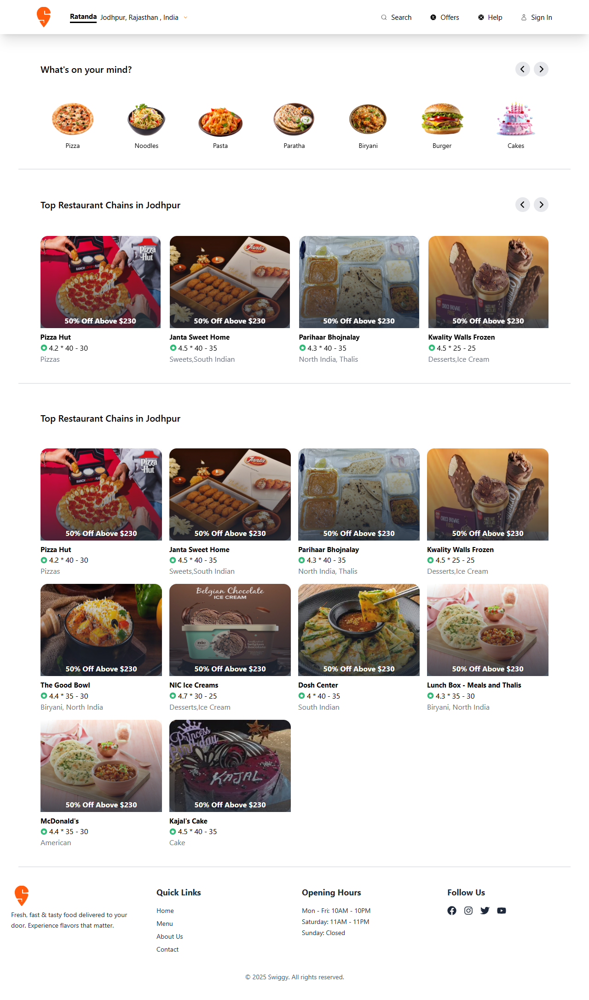
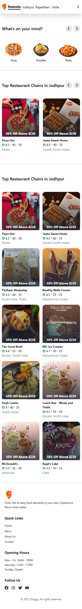

# 🍽️ Swiggy Clone - Food Delivery UI

A **fully responsive**, modern frontend clone of Swiggy — built using **React**, **Tailwind CSS**, **React Icons**, and **Swiper**. Data is served via a **mock API using JSON Server**.

---

## 📸 Preview

  


---

## 📁 Folder Structure

```
📆 Swiggy-Clone/
┣ 📁 public/
┣ 📁 src/
┃ ┣ 📁 components/
┃ ┣ 📁 pages/
┃ ┣ 📁 assets/
┃ ┣ 📄 App.jsx
┃ ┗ 📄 index.js
┣ 📄 db.json          ← Mock API
┣ 📄 tailwind.config.js
┗ 📄 package.json
```

---

## 🛠️ Tech Stack

| Tool         | Use                         |
| ------------ | --------------------------- |
| React        | Frontend UI                 |
| Tailwind CSS | Styling & Responsive Design |
| SwiperJS     | Sliders/Carousels           |
| React Icons  | Iconography                 |
| JSON Server  | Mock API & Data simulation  |

---

## 📱 Responsive Screens

✅ Mobile  
✅ Tablet  
✅ Desktop (Tested on resolutions: `360px` to `2560px`)

---

### 👨‍💻 Technologies Used

* HTML5  
* CSS3  
* JavaScript (Vanilla)  
* Git for version control

### 🧠 Learning Objectives

* Improve frontend development skills  
* Understand layout structuring  
* Practice responsive design  
* Get comfortable with Git and GitHub

### 🙌 Contribution

Pull requests are welcome. For major changes, please open an issue first to discuss what you would like to change.

### 📄 License

This project is for educational purposes only and is not affiliated with Swiggy.

### 🧑 Author

**Hassan Raza**  
GitHub: (https://github.com/alisraza123)  
Email: (alisraza123@gmail.com)  

---

# 📁 Clone the Repository

```bash
git clone https://github.com/alisraza123/Swiggy-Clone.git
cd Swiggy-Clone

# 🖥️ Terminal 1: React frontend start karo
npm install
npm start

# 🗂️ Terminal 2: JSON Server for category.json
json-server --watch data/category.json --port 5000

# 🗂️ Terminal 3: JSON Server for restaurantChains.json
json-server --watch data/restaurantChains.json --port 5001

# Optional: Agar json-server installed nahi hai to global install karo
npm install -g json-server
```

---

### 📲 Live Demo

Link: [https://fancy-swiggy.netlify.app/](https://fancy-swiggy.netlify.app/)
